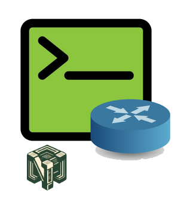

# Network configs Generator
    

A configurations commands generator for network equipments. It takes as input, an image of a network architecture containing the important informations for each equipment:
- hostnames,
- ip addresses,
- protocols,
- vlans and others

## Technologies Used
- Python,
- Jinja2,
- YOLO,
- PaddleOCR,
- YAML,
- Ansible for python sripts

## Features

## Process

The process can be devided in three layers:
- Detection,
- Data Extraction,
- Commands Generation

Before any operation, I started by letting the user import a network architecture image.

### 1. Detection
For this first operation, I finetuned a YOLO object detection model from Ultralytics to detect every zone on the image containing important informations like: text, or devices with text around.
I also used an object detection model to make the detection of equipment types on zones detected previously, containing network devices. 

### 2. Data Extraction
For this second layer, by using PaddleOCR, I made the extraction of the text on every detected zone from the previous layer.
I also implemeted a classification function in order to define the scope of the extracted text.

And the last process on this layer consisted of saving the extracted data in YAML files and devices hostnames in the inventory file.

### 3. Commands Generation
By providing the data in the YAML files and a playbook, Ansible helped me to generate configuration commands for every device on the image.

## Improvement Possibilities

## Usage
